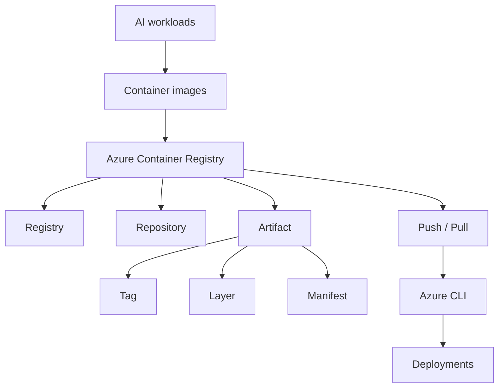

# AI 200 Course Guide

## Panoramica

Questo corso introduce Azure Container Registry (ACR) come base per la gestione sicura e scalabile di immagini container per applicazioni AI e servizi backend su Azure.

## Obiettivi di apprendimento

- Comprendere la struttura di ACR
- Organizzare registry, repository e artifact
- Gestire tag, manifest e digest
- Eseguire operazioni di push/pull con Azure CLI e Docker
- Applicare best practice di governance e distribuzione

## Moduli

- [[01-Introduzione]]
- [[02-Registries-Repositories-Artifacts]]
- [[03-Tags-Layers-Manifests]]
- [[04-ACR-CLI-e-Tutorial]]
- [[05-Best-Practices]]
- [[06-Resources]]

## Mappa concettuale

## Riassunto

ACR è il punto centrale per archiviare, versionare e distribuire immagini container in ambienti cloud. Per AI workloads, la capacità di gestire versioni immutabili, tag chiari e distribuzione sicura è fondamentale per ottenere deployment affidabili e verificabili.

## Note correlate

- [[01-Introduzione]]
- [[02-Registries-Repositories-Artifacts]]
- [[03-Tags-Layers-Manifests]]
- [[04-ACR-CLI-e-Tutorial]]
