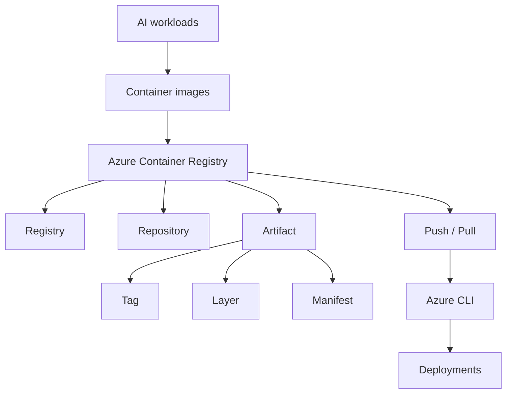

# AI 200 Course Guide

## Overview

This course introduces Azure Container Registry (ACR) as the foundation for securely and scalably storing container images for AI applications and backend services on Azure.

## Learning objectives

- Understand the structure of ACR
- Organize registries, repositories, and artifacts
- Build and run images with ACR Tasks
- Tag and version container images consistently
- Complete a practical exercise using ACR Tasks
- Assess knowledge and review key takeaways

## Units

- [[01-Introduction]]
- [[02-Registries-Repositories-and-Artifacts]]
- [[03-Build-and-Run-Images-with-ACR-Tasks]]
- [[04-Tag-and-Version-Images]]
- [[05-Exercise-Build-and-Manage-a-Container-Image-with-ACR-Tasks]]
- [[06-Module-Assessment]]
- [[07-Summary]]

## Concept map

## Summary

ACR is the central storage and distribution layer for container images in Azure. For AI workloads, the ability to manage immutable versions, consistent tags, and reliable deployments is essential for operational success.

## Related notes

- [[01-Introduction]]
- [[02-Registries-Repositories-and-Artifacts]]
- [[03-Build-and-Run-Images-with-ACR-Tasks]]
- [[04-Tag-and-Version-Images]]
